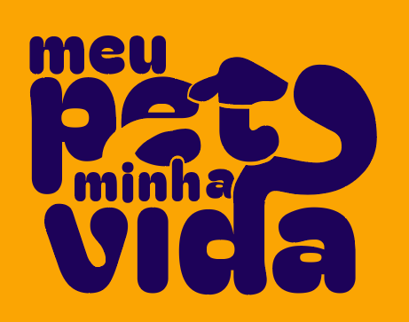

<a name="readme-top"></a>

[![Contributors][contributors-shield]][contributors-url]
[![Forks][forks-shield]][forks-url]
[![Stargazers][stars-shield]][stars-url]
[![Issues][issues-shield]][issues-url]
[![License][license-shield]][license-url]
[![LinkedIn][linkedin-shield]][linkedin-url]

<!-- [![LinkedIn][linkedin-shield]][linkedin-url] -->

<br />
<div align="center">
  <a href="https://github.com/otaldonuness/meupetminhavida-front">
    
  </a>

<h3 align="center">Meu Pet Minha Vida</h3>

  <p align="center">
    Project created with the goal of developing a platform capable of assisting in the pet adoption process.
    <br />
    <a href="https://github.com/otaldonuness/meupetminhavida-fronte"><strong>Explore the docs »</strong></a>
    <br />
    <br />
    <a href="https://github.com/otaldonuness/meupetminhavida-front">View Demo</a>
    ·
    <a href="https://github.com/otaldonuness/meupetminhavida-front/issues">Report Bug</a>
    ·
    <a href="https://github.com/otaldonuness/meupetminhavida-front/issues">Request Feature</a>
  </p>
</div>

<!-- TABLE OF CONTENTS -->
<details>
  <summary>Table of Contents</summary>
  <ol>
    <li>
      <a href="#about-the-project">About The Project</a>
      <ul>
        <li><a href="#built-with">Built With</a></li>
      </ul>
    </li>
    <li>
      <a href="#getting-started">Getting Started</a>
      <ul>
        <li><a href="#prerequisites">Prerequisites</a></li>
        <li><a href="#installation">Installation</a></li>
      </ul>
    </li>
    <li><a href="#usage">Usage</a></li>
    <li><a href="#roadmap">Roadmap</a></li>
    <li><a href="#contributing">Contributing</a></li>
    <li><a href="#license">License</a></li>
    <li><a href="#contact">Contact</a></li>
    <li><a href="#acknowledgments">Acknowledgments</a></li>
  </ol>
</details>

## About The Project

<!-- [![Product Name Screen Shot][product-screenshot]](https://example.com) -->

"Meu Pet Minha Vida" is an open source project created with the goal of developing a platform capable of assisting in the pet adoption process, where users can access and find their next pet to foster!

🇧🇷 "Meu Pet Minha Vida" é um projeto open source criado com objetivo de desenvolver uma plataforma capaz de auxiliar no processo de adoção de animais de estimação, onde os usuários podem acessar e encontrar seu próximo bichinho para acolher!

<p align="right">(<a href="#readme-top">back to top</a>)</p>

### Built With

- [![Next][Next.js]][Next-url]
- [![React][React.js]][React-url]

<p align="right">(<a href="#readme-top">back to top</a>)</p>

## Getting Started

This repository is related to the frontend of the platform.

### Prerequisites

- <u>**Git**</u>
- <u>**NodeJS**</u>
- <u>**Yarn**</u>: As Yarn is used in this project, please ensure that the tool is properly installed on your machine before proceeding. Although compatible, NPM may cause conflicts.

### Installation

1. Clone the repo
   ```sh
   # If it's for development purposes, please clone your fork.
   git clone https://github.com/otaldonuness/meupetminhavida-front.git
   ```
2. Install dependencies
   ```sh
   # Navigate to the directory where the repository was cloned on your machine.
   yarn
   ```

<p align="right">(<a href="#readme-top">back to top</a>)</p>

<!-- USAGE EXAMPLES -->

## Usage

**Open local dev server**:

```sh
# It usually opens at "http://localhost:3000", but please check in the terminal.
yarn dev
```

**Build for production:**

```sh
yarn build
```

**Test production build**:

```sh
# Make sure to run "yarn build" before.
yarn start
```

**Open storybook**: Storybook allows us to test components in isolation, and getting started is quite simple. Please refer to the <a href="https://storybook.js.org/docs/react/get-started/install" target="_blank">documentation</a> to learn more about how to use this tool.

```sh
# It usually open at "http://localhost:6006", but please check in the terminal.
yarn storybook
```

_For more examples, please refer to the [Documentation](https://example.com)_

<p align="right">(<a href="#readme-top">back to top</a>)</p>

<!-- ROADMAP -->

## Roadmap

- [ ] Feature 1
- [ ] Feature 2
- [ ] Feature 3
  - [ ] Nested Feature

See the [open issues](https://github.com/otaldonuness/meupetminhavida-front/issues) for a full list of proposed features (and known issues).

<p align="right">(<a href="#readme-top">back to top</a>)</p>

<!-- CONTRIBUTING -->

## Contributing

Contributions are what make the open source community such an amazing place to learn, inspire, and create. Any contributions you make are **greatly appreciated**.

If you have a suggestion that would make this better, please fork the repo and create a pull request. You can also simply open an issue with the tag "enhancement".
Don't forget to give the project a star! Thanks again!

1. Fork the Project
2. Create your Feature Branch (`git checkout -b feature/AmazingFeature`)
3. Commit your Changes (`git commit -m 'Add some AmazingFeature'`)
4. Push to the Branch (`git push origin feature/AmazingFeature`)
5. Open a Pull Request

<p align="right">(<a href="#readme-top">back to top</a>)</p>

<!-- LICENSE -->

## License

Distributed under the GPL License. See [LICENSE](LICENSE) for more information.

<p align="right">(<a href="#readme-top">back to top</a>)</p>

<!-- CONTACT -->

## Contact

Meu Pet Minha Vida - [@meupetminhavida](https://twitter.com/meupetminhavida) - contato@meupetminhavida.org

Project Link: [https://github.com/otaldonuness/meupetminhavida-front](https://github.com/otaldonuness/meupetminhavida-front)

Discord Community: [Meu Pet Minha Vida (Discord)](https://discord.com/invite/RAnhUJNv2j)

<p align="right">(<a href="#readme-top">back to top</a>)</p>

## Acknowledgments

- []()
- []()
- []()

<p align="right">(<a href="#readme-top">back to top</a>)</p>

[contributors-shield]: https://img.shields.io/github/contributors/otaldonuness/meupetminhavida-front.svg?style=for-the-badge
[contributors-url]: https://github.com/otaldonuness/meupetminhavida-front/graphs/contributors
[forks-shield]: https://img.shields.io/github/forks/otaldonuness/meupetminhavida-front.svg?style=for-the-badge
[forks-url]: https://github.com/otaldonuness/meupetminhavida-front/network/members
[stars-shield]: https://img.shields.io/github/stars/otaldonuness/meupetminhavida-front.svg?style=for-the-badge
[stars-url]: https://github.com/otaldonuness/meupetminhavida-front/stargazers
[issues-shield]: https://img.shields.io/github/issues/otaldonuness/meupetminhavida-front.svg?style=for-the-badge
[issues-url]: https://github.com/otaldonuness/meupetminhavida-front/issues
[license-shield]: https://img.shields.io/github/license/otaldonuness/meupetminhavida-front.svg?style=for-the-badge
[license-url]: https://github.com/otaldonuness/meupetminhavida-front/blob/master/LICENSE.txt
[linkedin-shield]: https://img.shields.io/badge/-LinkedIn-black.svg?style=for-the-badge&logo=linkedin&colorB=555
[linkedin-url]: https://linkedin.com/in/linkedin_username
[product-screenshot]: images/screenshot.png
[Next.js]: https://img.shields.io/badge/next.js-000000?style=for-the-badge&logo=nextdotjs&logoColor=white
[Next-url]: https://nextjs.org/
[React.js]: https://img.shields.io/badge/React-20232A?style=for-the-badge&logo=react&logoColor=61DAFB
[React-url]: https://reactjs.org/
